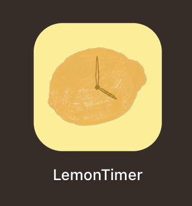
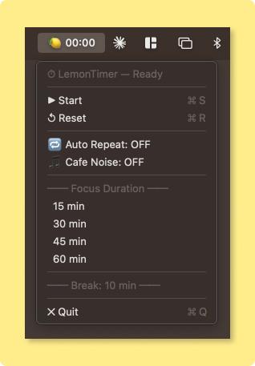
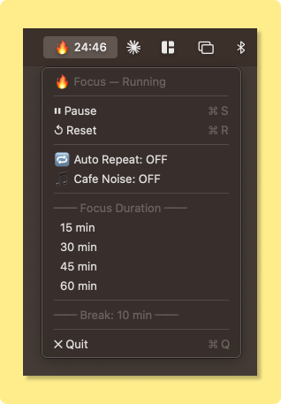
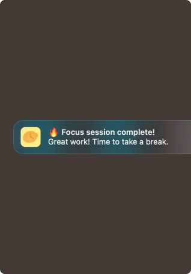

# 🍋 LemonTimer

A minimal macOS menu bar timer for focused work sessions, with built-in cafe ambiance.

  

<p align="center">
  
  
  
  
  
</p>

## Features

- **Menu bar timer** — Lives in your status bar, always visible while you work
- **Focus & Break sessions** — 15 / 30 / 45 / 60 min focus, 10 min break
- **Auto-start on select** — Pick a duration and it starts immediately
- **Auto Repeat** — Automatically cycles between focus and break
- **Cafe ambiance** — Built-in looping cafe noise (music + ambient chatter, crossfaded for seamless loop)
- **Visual countdown** — Text turns red (#FF3B3B) in the last 60 seconds
- **Push notifications** — Get notified when your timer ends
- **Status bar icons** — 🍋 idle / 🔥 focus / ☕ break / 🎵 noise on

## Install

Requires macOS 13+ and Xcode Command Line Tools (`xcode-select --install`).

```bash
git clone https://github.com/leeiseverywhere/LemonTimer.git
cd LemonTimer
bash build_and_run.sh
```

The build script will compile, sign, install to `/Applications`, and launch automatically.

## Usage

Click the timer in your menu bar to access all controls. Select a duration to start immediately.

## License

MIT

---

# 🍋 레몬타이머

macOS 메뉴바에서 동작하는 집중 타이머. 카페 배경음 내장.

## 기능

- **메뉴바 타이머** — 상태바에 항상 표시되어 작업 중에도 확인 가능
- **집중 & 휴식** — 15 / 30 / 45 / 60분 집중, 10분 휴식
- **선택 즉시 시작** — 시간을 고르면 바로 타이머 시작
- **자동 반복** — 집중 → 휴식 → 집중 자동 순환
- **카페 배경음** — 음악 + 카페 앰비언트를 크로스페이드 믹싱한 루프 오디오 내장
- **시각 카운트다운** — 마지막 1분에 빨간색(#FF3B3B)으로 변경
- **푸시 알림** — 타이머 종료 시 알림
- **상태바 아이콘** — 🍋 대기 / 🔥 집중 / ☕ 휴식 / 🎵 노이즈 ON

## 설치

macOS 13 이상 + Xcode Command Line Tools 필요 (`xcode-select --install`)

```bash
git clone https://github.com/leeiseverywhere/LemonTimer.git
cd LemonTimer
bash build_and_run.sh
```

빌드 스크립트가 컴파일 → 서명 → Applications 설치 → 실행까지 자동으로 처리합니다.

## 사용법

메뉴바의 타이머를 클릭하면 모든 컨트롤에 접근할 수 있습니다. 시간을 선택하면 바로 시작됩니다.

## 라이선스

MIT
